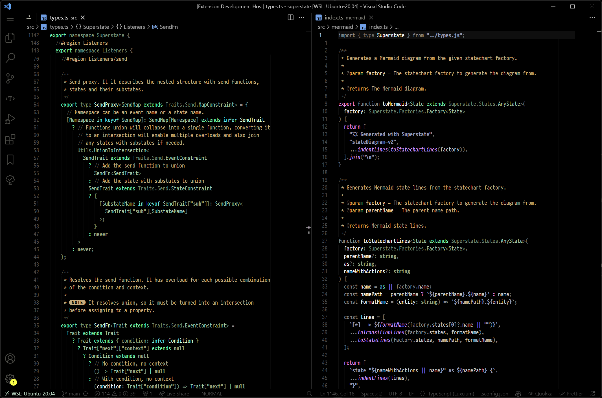

  

  <h1>Sophia Theme</h1>

  <h3>Code semantics-focused theme for Visual Studio Code</h3>

## Supported languages

I carefully crafted colors for the given languages, considering their semantics and idioms to the best of my ability.

I'm not a polyglot by any means, so if you notice an idiosyncrasy, please [DM me](https://twitter.com/kossnocorp) or [open a GitHub issue](https://github.com/kossnocorp/sophia/issues/new).

- **JavaScript**
- **TypeScript**
- **Rust**
- **Python**
- **JSX**
- **Markdown**
- **JSON**
- **YAML**
- **HTML**
- **GraphQL**
- **Makefile**
- **Justfile**
- **Nix**
- **Bash**
- **Zsh**
- **Fish**¹
- Swift
- F#

The languages marked with **bold** are the ones I'm the most proficient in and/or have the most detailed support.

- ¹ Fish works the best when identified as _Shell Script_, so that it uses _Bash_/_Zsh_ parsing rules. I think the future is in [`fish-lsp`](https://github.com/ndonfris/fish-lsp) by [@https://github.com/ndonfris](https://github.com/ndonfris), but currently the tokens it generates are barebone and not enough for semantic highlighting.

Other languages might work well, but I haven't tested them yet.

## Getting started

🚧 Work in progress, [follow me for updates](https://twitter.com/kossnocorp).

## Changelog

See [the changelog](./CHANGELOG.md).

## License

[MIT © Sasha Koss](https://kossnocorp.mit-license.org/)
